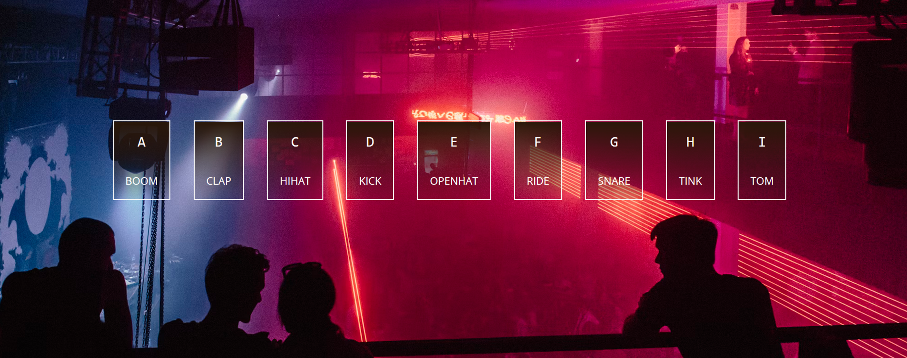

## Introduction

I am back after finally getting a website to post on [and after trying and switching from at least 3 themes due to various reasons]. Anyways, thanks to Hyde, we shall now focus on day one's [our day two] challenge.


Photo by [Gabriel Barletta](https://unsplash.com/@gabebarletta?utm_content=creditCopyText&utm_medium=referral&utm_source=unsplash) on [Unsplash](https://unsplash.com/photos/selective-focus-photography-of-red-drum-set--lWcaUVJ39Y?utm_content=creditCopyText&utm_medium=referral&utm_source=unsplash).

> Wonder why the very first day of this challenge comes after the fourth day? It's because I'm following up from [The Odin Project](https://www.theodinproject.com). I assure you that from hereon, the challenge will be in the usual order [barring the 4th day, of course].

### Anyways, let's get buildin'

> Source for those who are curious : [Drum Kit - Wes Bos](https://github.com/wesbos/JavaScript30/tree/master/01%20-%20JavaScript%20Drum%20Kit)

Tech used : JS DOM

Today we're building a drum-kit. The cover image of this post shows one as an example in case you don't know what a drum-kit is.

Our drum-kit site will do the following things when you press one of the displayed keys :

- Plays the sound associated with the key you press.
- Makes the displayed key bigger [i.e. it pops up with a jig] and applies a border around it.

#### Getting ready

We'll use the boilerplate provided by VSCODE by pressing `!` and hitting enter. Then we attach the stylesheet and external JS.

After that, we're creating a `<div>` with a set of `<div>` nested inside it.

Now we need to attach the audio files to our elements. For this, we'll be using [this website](https://www.toptal.com/developers/keycode) to get the key-codes for our letters.

##### What is this key-code stuff?

Let's take a look at the code for one of our keys:

```html
<div data-key="KeyA" class="key">
    <kbd>A</kbd>
    <span class="sound-info">boom</span>
</div>
```

Normally, we'd place the `<audio>` tag inside the `<div>` and then try to work with the button. This usually won't work. So, what I'm doing here is to create my own attribute [like a DIY attribute] named `key` and use that alongside this :

```html
<audio data-key="KeyA" src="day-one\boom.wav"></audio>
```

This is helpful for linking events using JS [using our class here, actually], which we'll see soon.

> The video must've shown the attribute `data-key=65` I presume? I'm sorry, but that's depreciated. The best way to get keys for JS DOM is to use `Key` alongside the key name.

#### Adding CSS

There are 2 ways to do the CSS for this page.

One is to add the styles to each element using their class selector. Very simple to work with.

The other is to have many tiny class-selectors, each serving a purpose. Makes the code modular. This method is usually preferred in web dev [this is why you see a hundred different classes for an element when you open up inspect element].

```html
<div data-key="KeyA" class="key flex flex-column box padding">
    <kbd>A</kbd>
    <span class="sound-info smaller-font">BOOM</span>
</div>
```

Ultimately, it's your choice - bundle 'em up into one big class, or split into many tiny classes. Both are okay.

> Makes the displayed key bigger [i.e. it pops up with a jig] and applies a border around it.

This effect can be done using a CSS class. JS DOM will add this class to the key the moment the key is pressed. Here we can define border stuff, box-shadows, etc.

The key has a class as well. It has this transition style which enables this animation.

```css
/* before transition */
.box 
{
    transition:all 0.05s;
    color: white;
    border: 0.1rem solid whitesmoke;
    background: rgb(41,23,9);
    background: linear-gradient(180deg, rgba(41,23,9,1) 0%, rgba(36,29,43,0.10452843246673671) 100%);
}
/* during transition */
.trans
{
    transform: scale(1.3);
    border-width: 0.2rem;
    background: rgb(164, 147, 133);
    background: linear-gradient(180deg, rgba(41,23,9,1) 20%, rgba(36,29,43,0.10452843246673671) 80%);
}
```

Now if you're wondering what I've changed, I've :

- Increased the border width
- Changed the linear gradient background as well as the background colour.
- Added a `transform` style that will make the boxes grow 1.3x their OG size.

`transition:all` makes the every element coming under the selector get the transition effect.

#### Adding JS

> If you're using external JS, ensure that your `<script>` tag has a `defer` attribute in it. It ensures your scripts are loaded AFTER the html is parsed.

We'll focus on listening to a key-down event [when user presses down a key in their keyboard].

We already know that the keys in our keyboard have key-codes assigned to each.

```js
function addAudioWhenKeyDown(e)
{
    console.log(e);
}
window.addEventListener('keydown', addAudioWhenKeyDown);
```

Using this, we can get the key and key-code from the console tab.

```js
function addAudioWhenKeyDown(e)
{
    let audio = document.querySelector(`audio[data-key=${e.code}]`);
    console.log(audio);
    audio.currentTime = 0;
    audio.play();
}
```

> `e.keyCode` is depreciated. Better use `e.code` instead.

Now our audio file are playing smoothly! We've added `audio.currentTime` so that when you press the key multiple times, the audio rewinds back from the beginning and plays as many times instead of delaying.

At times, you may get `null` along with a `TypeError`. This is because that key doesn't have an audio file assigned to it! To prevent that unnecessary message, add ``if (!audio) return;`` to your function definition.

```js
function addAudioWhenKeyDown(e)
{
    //...
    let key = document.querySelector(`.key[data-key="${e.code}"]`);
    //...
    console.log(key);
    key.classList.add('trans');
}
//<div class="key flex flex-column box padding" data-key="KeyC">
```

Our transition effect is working well. However, there is a problem - we can't revert back to normal without refreshing the page.

So, we need to add yet another event listener to remove the class from the keys :

```js
window.addEventListener('keyup', removeTransitionEffect);

function removeTransitionEffect(e)
{
    let keyDone = document.querySelector(`.key[data-key="${e.code}"]`);
    keyDone.classList.remove('trans'); 
}
```



Background image by Aleksandr Popov from Unsplash

Aaaand we're done! The files are enclosed in the repository, and thank you for reading till the end! See ya next time with a brand new walkthrough.
