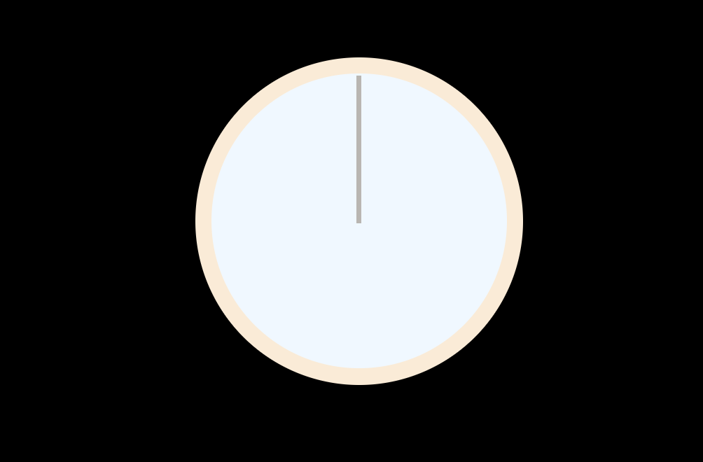
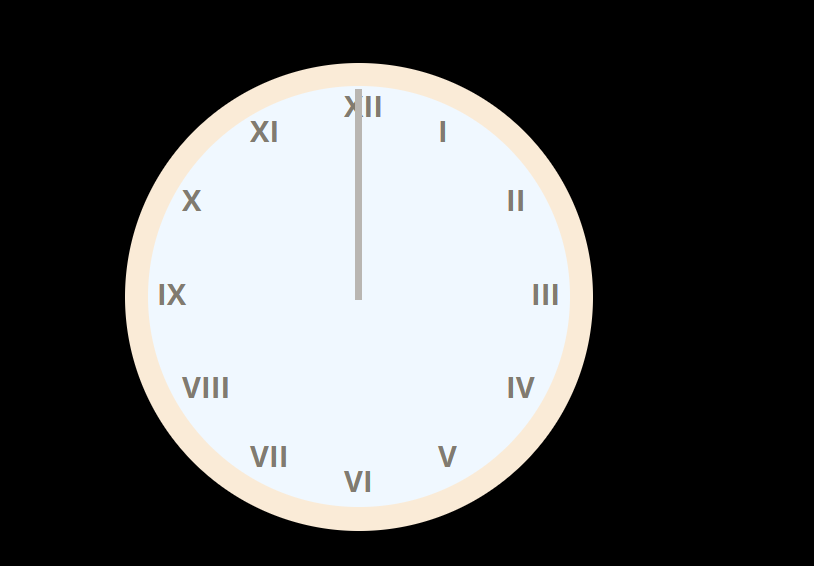

## Introduction

Welcome back to the 3rd day of the challenge! My exams have finally ended for now and this means I've enough free time to focus on side-projects such as this. Thinking of doing a piano-based keyboard-tapping [based on previous day's exercise] soon. Anyways, today we're gonna tackle another problem : building a clock.


Photo by [Adrien Robert](https://unsplash.com/@adrienrobert?utm_content=creditCopyText&utm_medium=referral&utm_source=unsplash) on [Unsplash](https://unsplash.com/photos/silver-twin-bell-alarm-clock-at-805-FguerUFGEJI?utm_content=creditCopyText&utm_medium=referral&utm_source=unsplash)

### So, let's get buildin'

Let's build a simple analog clock and link to current time using JS. This means the clock is going to run in real-time [no static!]. This clock will also have the appropriate Roman numeral assigned to each hour.

#### HTML Boilerplate

Last exercise, I must've told you about the `!` snippet. If possible, review that part [here](./2024-10-09-2-day-1.md).

What if I told you that you can edit the snippet and save yourself some work on adding ``<div class="container">``, stylesheet, etc.?

```json
"HTML Boilerplate":
	{
		"prefix": "!",
		"body":
		[
			"<!DOCTYPE html>",
      		"<html lang=\"en\">",
      		"<head>",
      		"    <meta charset=\"UTF-8\">",
      		"    <meta name=\"viewport\" content=\"width=device-width, initial-scale=1.0\">",
      		"    <meta http-equiv=\"X-UA-Compatible\" content=\"ie=edge\">",
      		"    <title>${1:Document}</title>",
			"    <link rel=\"stylesheet\" href=\"\">",
      		"</head>",
      		"<body>",
			"    <div class=\"container\">",
      		"    ${0}",
			"    </div>",
			"    <script src=\"\" defer></script>",
      		"</body>",
      		"</html>"
		],
		"description": "HTML Boilerplate"
	}
```

Simple, follow these steps :

- Hit `ctrl+shift+p` to get the command palette. If not, go to View and then click Command Palette.
- Type configure snippets and hit enter.
- Now type html. You'll get an option for `html.json`. Again hit enter.
- Paste the above code in that file and save it.

Now let's get back to business.

```html
<div class="center clock round">
    <div class="clock-face round">
        <div class="hand hour-hand"></div>
        <div class="hand min-hand"></div>
        <div class="hand sec-hand"></div>
    </div>
</div>
```

With some CSS magic, we can make our clock look like this :



Get the CSS file for this website [here](assets\day-two\day-two.css)!

#### Adding Roman Numerals

Let's do something extra - adding Roman numerals to indicate the hour of the day. First, add `<div>`s for each number inside the HTML file.

```html
<!--...-->
<div class="clock-face round">
    <div class="roman-num">
        <div class="number" style="--i:9;">I</div>
        <div class="number" style="--i:10;">II</div>
        <!--...-->
        <div class="number" style="--i:8;">XII</div>
    </div>
</div>
<!--...-->
```

Okay, why this unusual ordering? Why would the number I have the style for number IX and so on?

This is due to how `transform` works :

```css
.roman-num
{
    top: 50%;
    left: 2%;
}
.number
{
    color:rgb(129, 123, 112);
    font-weight: bold;
    position: absolute;
    width: 2rem;
    height: 2rem;
    transform: rotate(calc(var(--i) * 30deg)) translate(8rem) rotate(calc(var(--i) * -30deg));
}
```

So, when we pass a value of 9 to our variable `--i`, it translates into this :

```css
transform: rotate(calc(270deg)) translate(8rem) rotate(calc(270deg));
/* 9 * 30deg = 270deg */
```

270 degrees will mean the number is placed at the top [when starting from where IX would be]. Given the value changes in the variable, it means the numbers are placed at an interval of 30 degrees.

`translate` here simply means that the numbers are thrown out to the edge of the clock's face from their original position in the center.



#### Updating time

Now let's update the clock's time using JS.