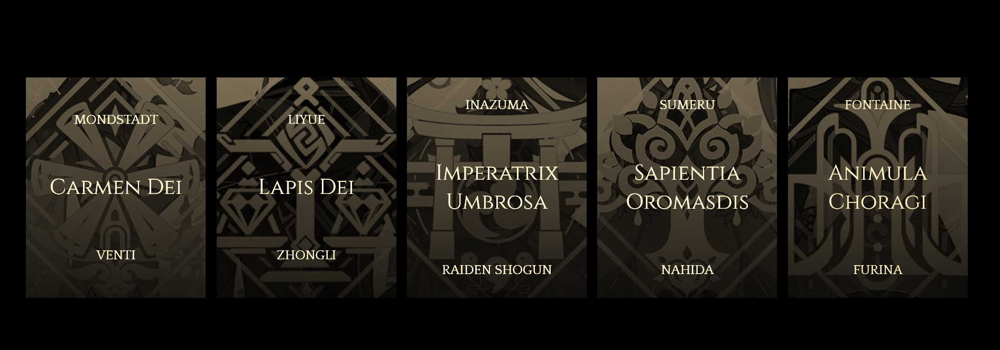
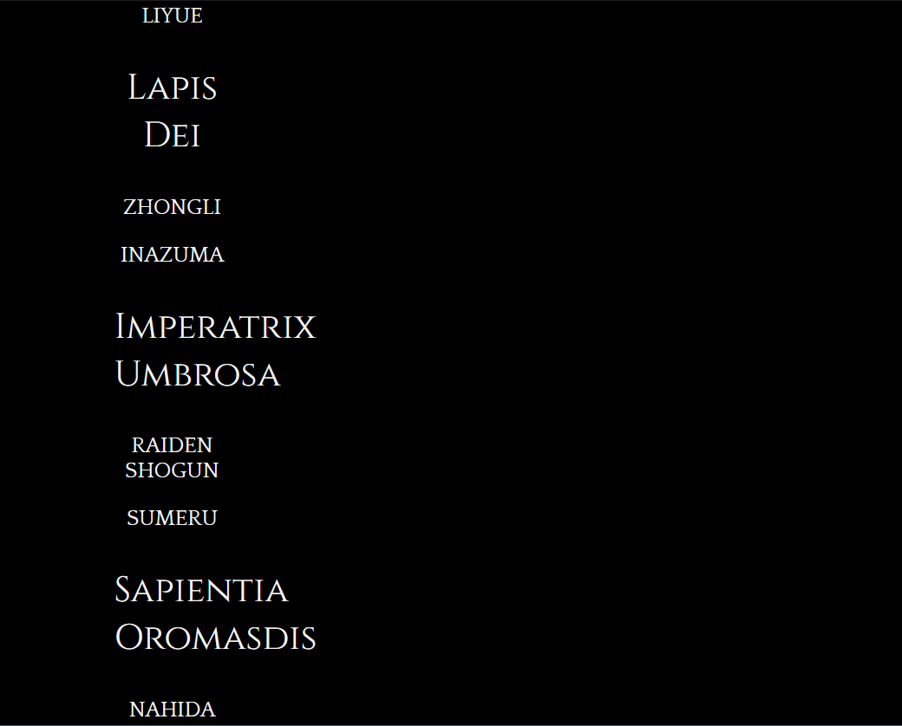
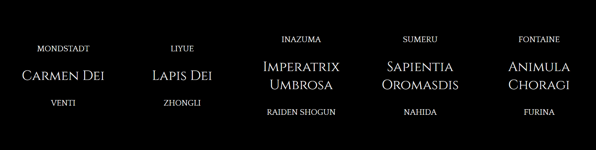
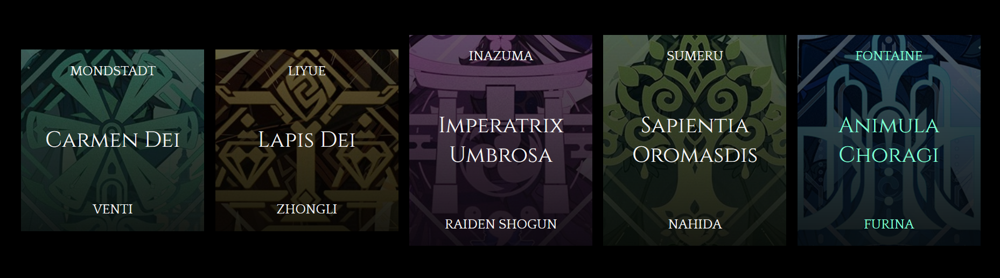
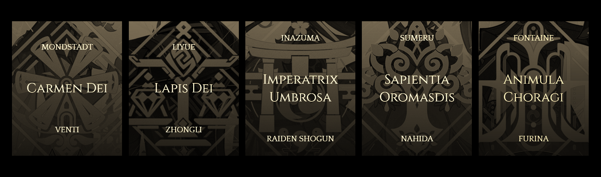
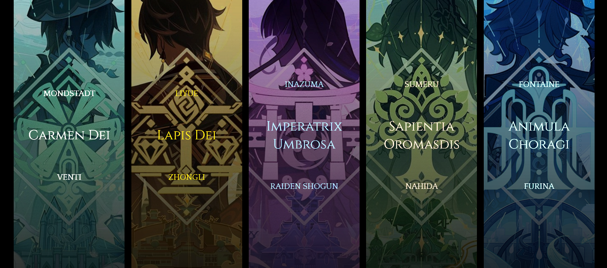

## Introduction

On this very special day, I decided to do not one, but two exercises in a single day! Helps me give me a kind of jogging for front-end stuff.


Photo by [Alvan Lee](https://unsplash.com/@alvannee?utm_content=creditCopyText&utm_medium=referral&utm_source=unsplash) on [Unsplash](https://unsplash.com/photos/a-woman-standing-near-a-painting-in-a-modern-art-gallery-MKuBzj9rcD0?utm_content=creditCopyText&utm_medium=referral&utm_source=unsplash)

And today's exercise is going to depend heavily on CSS so make sure your CSS skills are up to the mark!

### And without further ado, let's go!

In today's exercise, we're going to arrange 5 archons from a game, Genshin Impact [played it a lot in the past] in a grid-like fashion. When we move our mouse over an image, it'll immediately show some additional text.

Our final image will look like this :



#### Building the HTML

First, we'll create the usual stuff with our boilerplate. Next, we add in a `<div>` [main panel], inside which are nested 5 other `<div>`. 5 image panels for 5 archons [on the date I'm typing this, Mavuika hasn't been released yet. Don't blame me if I don't have her design yet].



Agh, our page looks not-so-nice. Let's fix it up with CSS, hmm?

#### CSS

Did you know that you can also have CSS styles as snippets? I didn't knew this earlier, but now that I do, I don't have to type out my frequently used styles every time and instead just slap them in my stylesheet.

One such snippet is this one for `body` style :

```json
"Retrieve body" :
{
	"prefix": "bd",
	"body" :
	[
		"@import url('https://fonts.googleapis.com/css2?family=Open+Sans:ital,wght@0,300..800;1,300..800&display=swap');",
		"",
		"body",
		"{",
		"    font-family: 'Open Sans', monospace;",
    	"    font-size: 20px;",
    	"    margin: 0;",
    	"    padding: 0;",
		"}"
	],
	"description": "Create body style"
}
```

Now we shall simply add the usual flex style. Then we go back to our page...



Fuck yeah! Now it looks sick. But where are the images?

##### Adding image with vignette

We add the images using another style, `background-image`. Along with the images, we shall add a `linear-gradient` with its colours set to black [rgb(0, 0, 0)].

```css
.image-five
{
    background-image: linear-gradient(to bottom, rgba(0, 0, 0, 0.6), rgba(0, 0, 0, 0.9)), url("..\\images\\furina.png");
}
```

Our classes in the HTML page will look like this : flex and flex-column along with the image's individual class.

```html
<div class="image image-five flex flex-column">
    <p class="header-text quattrocento">FONTAINE</p>
    <p class="displayed-text cinzel">Animula Choragi</p>
    <p class="footer-text quattrocento">FURINA</p>
</div>
```



Not only are the images unevenly sized, there's also a lack of sepia-ness in them...

This is when we introduce another class called `before-change`. We change the height of our image to 50vh [that's how you get that square-box-like look] and add a slightly sepia filter.

```css
.before-change
{
    height: 50vh;
    transition: all 0.8s ease;
    filter:sepia(10);
}
.after-change
{
    height: 100vh;
    transition: all 0.8s ease;
    filter:brightness(2);
}
```

Also define in another class called `after-change`. We'll need it soon when we animate the page.



The page looks *splendid*! Now let's animate it using JS.

#### JS

First, select the images using `querySelectorAll()`.

Then add in a for-each loop that adds an event listener [triggering upon click]. This listener will call a function that you'll soon define.

```js
panels.forEach(image => image.addEventListener('click', toggleClass));
```

Yep. Now define a function that takes `event` as its argument [this means image will go in with the function]. In this function, assign a variable the value of `event.target`.

```js
function toggleClass(event)
{
    let element = event.target;
    element.classList.toggle('after-change');
    element.classList.toggle('before-change');
}
```

What are we doing here? We simply toggle the two classes, `before-change` and `after-change` on and off when we click the image.

#### And voila



The final video can be fetched from day-five folder in assets. The folder containing it is named 'video'.
