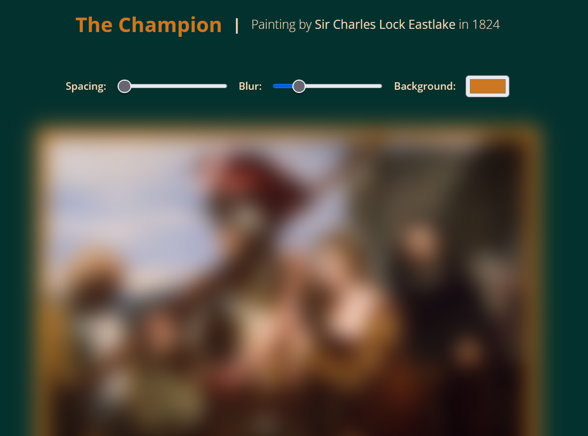
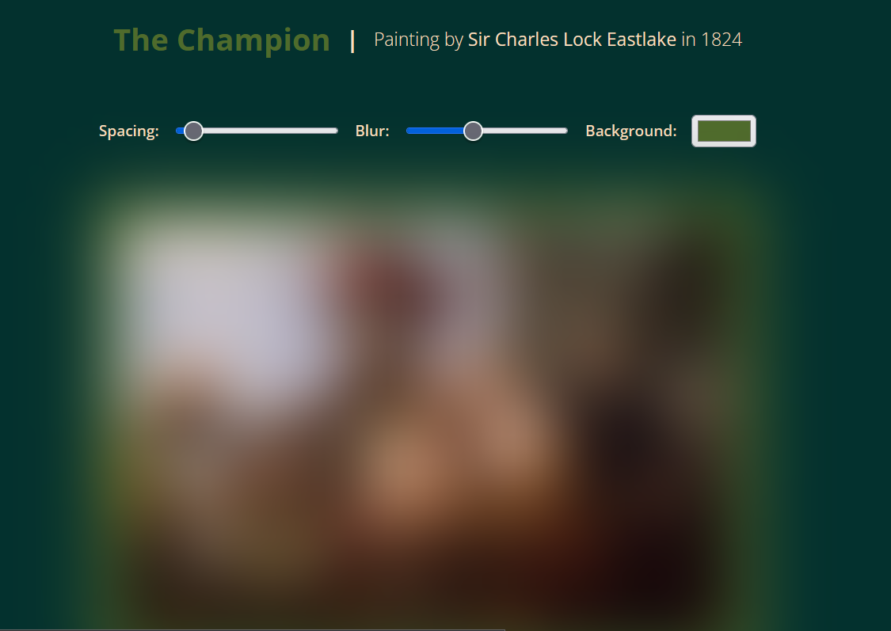

## Introduction

Welcome back to today's show where we mess around with CSS variables [please not the Sims version of it] using our shiny new tool, JS.

We'll be using this painting, titled 'The Champion' painted by Sir Charles Lock Eastlake in 1824, for today's exercise.


Photo by [Birmingham Museums Trust](https://unsplash.com/@birminghammuseumstrust?utm_content=creditCopyText&utm_medium=referral&utm_source=unsplash) on [Unsplash](https://unsplash.com/photos/medieval-painting-qYM3UdDslbk?utm_content=creditCopyText&utm_medium=referral&utm_source=unsplash)

### So let's get started

We build our HTML file using the boilerplate we'd defined earlier in our previous tutorial. Then we add in 3 `<label>` elements with their respective `<input>` elements.

```html
<label for="spacing">Spacing:</label>
<input type="range" name="spacing" min="1" max="20" value="1" data-sizing="rem">
<label for="blur">Blur: </label>
<input type="range" name="blur" min="0" max="5" value="1" data-sizing="rem">
<label for="base">Background: </label>
<input type="color" name="base" value="#CC7722">
```

Let's understand what's at hand :

- `type` : Indicates the type of input we're receiving
- `min` : Minimum value
- `max` : Maximum value
- `value` : Increment / Decrement by what value
- `data-sizing` : Unit used for values

You can safely ignore the lack of `placeholder` attribute error given by HTML.

#### CSS

Now here's where we take some real care :

```css
:root
{
    /* variables */
    --blur: 1rem;
    --spacing: 1rem;
    --base: #CC7722;
    /* styles */
    font-size: 20px;
}
```

These are the variables defined in the `root` part of CSS [note: `root` = `<html>`].

Then we use it in our styles :

```css
.property
{
    padding: var(--spacing);
    background: var(--base);
    filter: blur(var(--blur));
}
```

Let's add a heading on top that has the same colour as the painting's border.



#### JS

Now let's update the CSS variables with JS so they change with input.

First, we select all the `<input>` elements inside the `<div>`:

```js
let input = document.querySelectorAll('.controls>input');
```

Next, we define a function that takes element as an argument. 

We assign a variable the value of ``element.dataset.sizing || ""`` [`data-sizing` attribute in `<input>` -> `dataset.sizing`]. This means that we get the sizing unit for our further operations.

Then we use `setProperty` on the document itself [remember, `root` = `<html>` = document].


```js
document.documentElement.style.setProperty("--" + element.name, element.value + suffixValue);
```

What we're doing here is : setting up the ``--variableName : value`` format [or syntax] we'd do in `:root` in CSS. This one will receive the custom values we'd pass to it as input.

To pass the said input, we use a for-each loop. Inside it, we call the function with input, then add an event listener to call it when we move the buttons in the page :

```js
input.forEach((input) =>
{
    updateVar(input);
    input.addEventListener("input", () => updateVar(input));
});
```

And voila!



[The video showcasing this website, as well as the source code is available in the repository].
